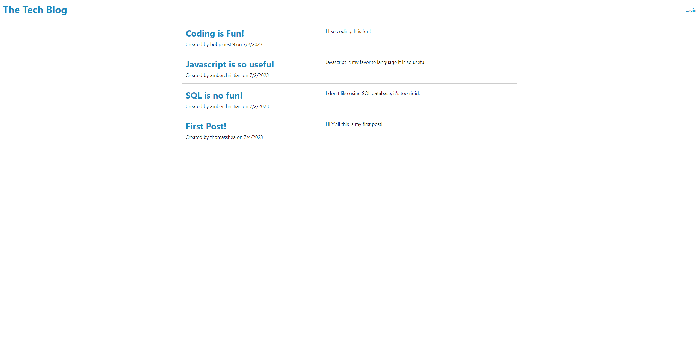
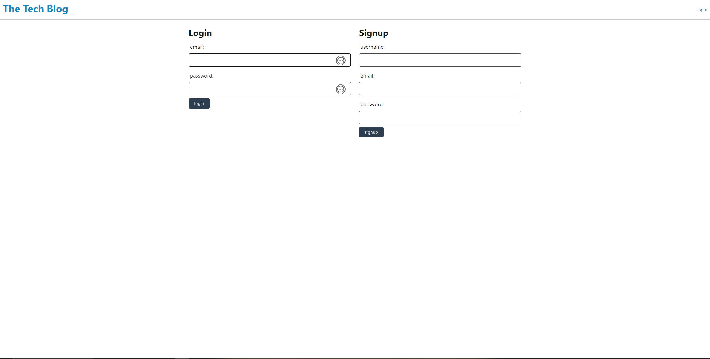
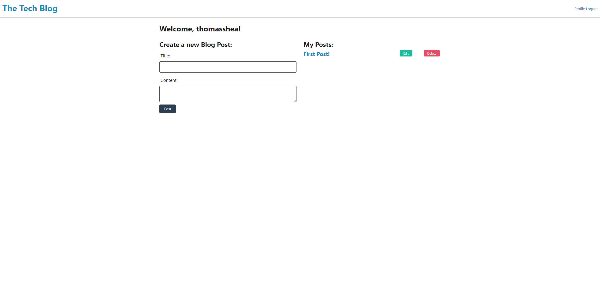

# The Tech Blog

## Description

This project is a simple blog that allows developers to connect and share their thoughts. The purpose of creating this project is to allow me to easily communicate and network with other developers to help me secure the best jobs.

## Installation

If you would like to run the application on your local machine please follow the following steps:

1. Navigate to my [Github Repo](https://github.com/thomasjshea/Tech-Blog)
2. Clone the repo to your local machine using the commange `git clone`
3. Open the repository in VS Code or whatever you use to modify code.
4. In your integrated terminal, run the command `npm i` to install all dependencies
5. Run the command `npm start` then navigate to https://localhost:3001

## Usage

- To use this app navigate to the [Homepage](https://thomas-tech-blog-8e9c91558429.herokuapp.com/)
- Navigate to the login page to create an account.
- Creating an account will take you to your profile page where you can start creating posts!

Screenshots:

## Credits

For this project, I used the mini project for this unit as a template. Other than that I created it on my own with no assistance

## License

This project uses the MIT license

